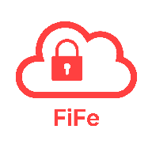

<div align="center">
  
  
  # FiFe - Your private Files Ferry
  
  **[https://fife.jeero.one](https://fife.jeero.one)**

  An open-source, cloud storage backup service built with zero-trust architecture. Your data is encrypted locally before it ever leaves your device.
  
  
  
  
  
</div>

<br/>

## 🛡️ Why FiFe?

Traditional cloud storage providers hold the keys to your data. FiFe shifts the control back to you. By combining **Bring Your Own Storage (BYOS)** with strict **Client-Side Encryption**, FiFe ensures that nobody—not even the server hosting the app—can read your files.

## ✨ Key Features

- **🔒 Zero-Knowledge Client-Side Encryption:** Files are encrypted entirely on your device using `libsodium` before uploading. The server only stores encrypted key ciphers and nonces.
- **☁️ Bring Your Own Storage:** Connect your own object storage buckets. Currently supports **Backblaze B2**, **Cloudflare R2**, **Oracle Object Storage**, **IDrive E2**, and generic **S3-compatible** providers.
- **📂 Preserves Folder Structure:** Back up entire directories without losing your organizational hierarchy.
- **⚡ Smart Duplicate Detection:** Computes hashes locally on-demand to detect duplicate files, saving your bandwidth and storage space.
- **🚀 Direct-to-Cloud Uploads:** Uploads bypass the backend completely, utilizing secure, pre-signed URLs directly to the storage provider.
- **🚫 Zero Tracking:** Built with strict privacy in mind. Absolutely no third-party analytics or data harvesting.

## 🏗️ Architecture & Tech Stack

FiFe is split into a robust cross-platform client and an edge-optimized server:

**Frontend / Client App**
- Built with **Flutter** for Android, iOS, OSX, and Linux (AppImages).
- Background task synchronization using Workmanager.
- Local metadata management via SQLite.

**Backend / API**
- Built with **SvelteKit** and deployed on **Cloudflare Workers**.
- Database: **Neon Postgres** using **Drizzle ORM**.
- Uses Cloudflare Hyperdrive for accelerated database connections.
- Authentication handled securely via Email OTP (Neon.tech).

## 🚀 Getting Started

### Prerequisites
- Flutter SDK (latest stable)
- Node.js & npm (for backend development)
- A Neon Postgres database URL
- Cloudflare Wrangler CLI

### Running the App Locally

1. **Clone the repository:**
   ```bash
   git clone https://github.com/jeerovan/secure_file_vault.git
   cd secure_file_vault
   ```

2. **Run the Flutter Client:**
   ```bash
   flutter pub get
   flutter run
   ```

3. **Backend Setup (SvelteKit):**
   Navigate to the server directory, install dependencies, and configure `DATABASE_URL` in `.env`. If it is omitted, database scripts use `postgres://jeerovan@localhost:5432/fife`.
   ```bash
   cd backend
   npm install
   npm run db:seed postgres # local PostgreSQL
   npm run db:seed neon     # production Neon
   npm run dev
   ```

   The driver argument is optional. Scripts infer Neon for `*.neon.tech` URLs and standard PostgreSQL for other URLs.

### Local integration testing

Local integration mode bypasses only Neon authentication and exercises the real local backend, PostgreSQL database, encryption, synchronization, and S3-compatible storage transfer paths.

1. Copy `backend/.env.example` to `backend/.env` and configure the `LOCAL_TEST_*` values. Use the same random token for the backend and Flutter build.
2. Ensure the database is initialized and provider ID 6 is registered:

   ```bash
   cd backend
   npm run db:add-s3 postgres
   npm run dev:local
   ```

3. Launch the client:

   ```bash
   flutter run \
     --dart-define=LOCAL_TESTING=true \
     --dart-define=LOCAL_TEST_AUTH_TOKEN=<RANDOM_LOCAL_TOKEN>
   ```

4. Sign in with `jeevan@jeero.one`. iOS Simulator connects through `localhost`; Android Emulator uses `10.0.2.2`.
5. Create the profile and register the device, then open **Storage**, select **S3 Compatible**, and enter the test storage credentials in the client. This exercises client-side validation and the normal `/api/s3/add-account` API. The S3 endpoint must be a public HTTPS URL in every mode, including local testing.

Local logout deletes the test profile and its S3 object prefix before clearing the client.

### Building for iOS

`permission_handler` is used for Android storage permissions and iOS notifications. Camera and photo-library permission code must not be compiled into the iOS app unless the corresponding user-facing usage descriptions are intentionally added to `ios/Runner/Info.plist`.

Before the first iOS build after cloning, changing branches, changing `permission_handler.yaml`, or editing an iOS usage description, run:

```bash
flutter clean
flutter pub get
dart run permission_handler_apple:select app-store
```

Then build normally, for example:

```bash
flutter build ipa --release
```

The selection command clears stale Swift Package Manager/Xcode permission caches. The **Verify iOS Permissions** Runner build phase stops Xcode archives when the selection is missing, stale, or does not match the active build configuration. Do not bypass that build-phase failure; rerun the selection command instead.

## 🤝 Contributing

Contributions, issues, and feature requests are welcome! Feel free to check the [issues page](https://github.com/jeerovan/secure_file_vault/issues).

1. Fork the Project
2. Create your Feature Branch (`git checkout -b feature/AmazingFeature`)
3. Commit your Changes (`git commit -m 'Add some AmazingFeature'`)
4. Push to the Branch (`git push origin feature/AmazingFeature`)
5. Open a Pull Request

## 📄 License

This project is open-source and available under the [AGPL-3.0 License](LICENSE).
